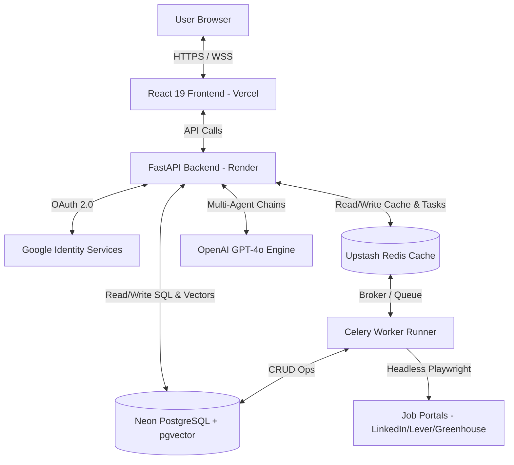

# 🚀 JobPilot AI — Enterprise AI Job Copilot

JobPilot AI is a production-ready, enterprise-grade AI-powered job application assistant and automation platform. It automates job search discovery, ATS optimization, resume tailoring, cover letter drafting, interview coaching, and one-click browser-based application automation.

---

### 🌐 Live Production URLs

- **Live Web Application:** [https://job-pilot-ai-priyatam-ux.vercel.app/](https://job-pilot-ai-priyatam-ux.vercel.app/)
- **Live Backend API (Swagger):** [https://jobpilot-backend-l4o2.onrender.com/docs](https://jobpilot-backend-l4o2.onrender.com/docs)
- **Database & Vector Store:** Neon Serverless PostgreSQL (with `pgvector`)
- **Queue & Cache Store:** Upstash Serverless Redis (TCP Protocol)

🔑 **Demo Login Credentials:**
- **Email:** `admin@example.com`
- **Password:** `adminpassword123`
- *Alternatively, use Google Sign-In on the live web portal.*

---

## 🏗️ System Architecture

JobPilot AI utilizes a decoupled monorepo architecture separating the responsive React frontend from the high-throughput FastAPI backend. Background worker queues execute scraping and browser automation processes asynchronously.



### Key Architectural Layers

1. **Frontend App (React 19 + Vite):** A modern single-page application built using TailwindCSS for custom glassmorphism styling, Zustand for global auth and application state management, and React Router DOM for clean client-side routing.
2. **Backend API (FastAPI):** High-performance Python backend serving REST endpoints. Features secure stateless JWT session authentication, robust CORS middleware, and automatic database connection pooling.
3. **Multi-Agent AI Engine (LangGraph + OpenAI):** Handles intelligence operations (ATS scoring, resume tailoring, career coaching, cover letter generation) via stateful graph execution patterns, structured with Pydantic via the Instructor library.
4. **Task Queues & Brokers (Celery + Redis):** Manages asynchronous jobs like running browser automation scripts, performing daily web scraping tasks, and matching resumes against job descriptions in the background.
5. **Vector Search (pgvector):** Embeds job descriptions and candidate resumes into 1536-dimensional vector spaces using OpenAI embeddings, enabling fast semantic matching and candidate relevance scoring directly inside SQL queries.

---

## 📂 Project Structure

```
ai-job-copilot/
├── backend/
│   ├── app/
│   │   ├── agents/          # Multi-agent LangGraph workflows
│   │   ├── api/             # Versioned endpoint routers (V1)
│   │   ├── browser/         # Playwright automation scripts and portal adapters
│   │   ├── core/            # Config settings, Database engine, Security utilities
│   │   ├── models/          # SQLAlchemy SQL models
│   │   ├── repositories/    # Database repository pattern abstraction
│   │   ├── schemas/         # Pydantic schemas (request validation / serialization)
│   │   └── tasks/           # Celery asynchronous background tasks
│   ├── alembic/             # Database migration setup
│   ├── requirements.txt     # Python dependencies
│   └── Dockerfile           # Backend container specification
├── frontend/
│   ├── src/
│   │   ├── components/      # Reusable UI widgets
│   │   ├── pages/           # Page layouts (Dashboard, ATS, Career Coach, Job Discovery)
│   │   ├── router/          # React router routes mapping
│   │   ├── services/        # API client modules
│   │   └── store/           # Zustand state managers
│   ├── package.json         # Node dependencies
│   ├── vercel.json          # Vercel SPA routing config
│   └── Dockerfile           # Frontend static server container
├── docker-compose.yml       # Local infrastructure setup (DB & Cache)
└── render.yaml              # Render configuration blueprint
```

---

## ⚡ Production Deployment

### Backend (Render Web Service)
1. Link your GitHub repository to Render.
2. Create a new **Web Service** using the `render.yaml` configuration.
3. Set the following environment variables:
   - `DATABASE_URL`: Your Neon PostgreSQL connection string (prefixed with `postgresql+psycopg://`).
   - `REDIS_URL`: Your Upstash Redis URL (prefixed with `rediss://`).
   - `OPENAI_API_KEY`: Your production OpenAI API key.
   - `JWT_SECRET`: A secure cryptographically random 256-bit string.
   - `GOOGLE_CLIENT_ID` / `GOOGLE_CLIENT_SECRET`: Credentials from Google Developer Console.
   - `CORS_ORIGINS`: `["https://job-pilot-ai-priyatam-ux.vercel.app"]`

### Frontend (Vercel)
1. Import the repository on Vercel.
2. Select the `frontend` subfolder as the root directory.
3. Set Framework Preset to **Vite**.
4. Deploy the application (the SPA routing rules inside `vercel.json` are automatically loaded).

---

## 💻 Local Development Setup

### Prerequisites
- Node.js (v20+)
- Python (v3.11+)
- Docker Desktop

### Steps
1. **Clone the repository:**
   ```bash
   git clone https://github.com/Priyatam-UX/JobPilot-AI.git
   cd JobPilot-AI
   ```

2. **Launch PostgreSQL & Redis locally:**
   ```bash
   docker-compose up -d
   ```

3. **Set up backend:**
   ```bash
   cd backend
   python -m venv venv
   # Windows
   .\venv\Scripts\activate
   # macOS/Linux
   source venv/bin/activate
   
   pip install -r requirements.txt
   ```

4. **Initialize local database schemas & seed data:**
   ```bash
   $env:PYTHONPATH="."
   python -m app.core.seed
   ```

5. **Start FastAPI backend server:**
   ```bash
   python -m uvicorn app.main:app --reload --host 127.0.0.1 --port 8000
   ```

6. **Set up and start frontend:**
   ```bash
   cd ../frontend
   npm install --legacy-peer-deps
   npm run dev
   ```

7. Access the app locally at **`http://localhost:5173`**.
